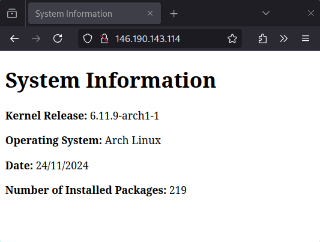

# 2420-Assignment-3-1

# Setting up an Nginx web server on an Arch Linux droplet

1. First thing you need to do is ensure your Linux system is up-to-date:
```
sudo pacman -Syu
```

2. Clone this repository into your home directory:
```
git clone https://github.com/thongish/2420-Assignment-3-1.git ~/nginx-setup
```

3. cd into the cloned directory:
```
cd ~/nginx-setup
```

4. Run the script with this command:
```
sudo ./setup-script
```

5. Check that everything worked by entering your droplet's IP address in your web browser. You should see something like this:


